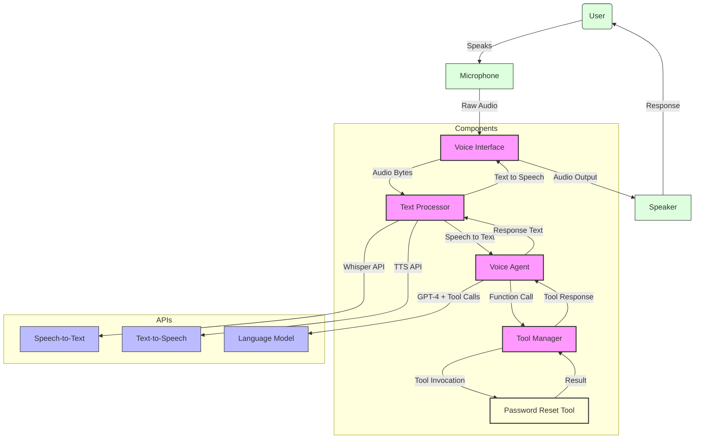

# Voice Agent Architecture

This diagram illustrates the architecture and data flow of the voice-enabled password reset agent. The system consists of several key components:

1. **Voice Interface**: Handles audio input/output using PyAudio
2. **Text Processor**: Converts between speech and text using OpenAI APIs
3. **Voice Agent**: Processes requests using OpenAI's GPT-4 model
4. **Tool Manager**: *Logical component* within the Voice Agent that manages function calls (not a separate class in MVP)
5. **Password Reset Tool**: Generates temporary passwords

## Data Flow
1. User speaks a password reset request
2. Voice Interface captures audio through microphone
3. Text Processor converts speech to text using Whisper API
4. Voice Agent processes the request text using GPT-4
5. GPT-4 determines a tool call is needed and invokes the Password Reset Tool
6. Password Reset Tool generates a temporary password and returns the result
7. Voice Agent formulates a response using the tool result
8. Text Processor converts response to speech using TTS API
9. Voice Interface plays the audio response
10. User hears the generated password

## Component Details

### Voice Interface
- **File**: `src/voice_agent/voice/interface.py`
- **Class**: `VoiceInterface` 
- **Responsibilities**:
  - Audio capture from microphone
  - Audio playback through speakers
  - Audio format handling

### Text Processor
- **File**: `src/voice_agent/text.py`
- **Class**: `TextProcessor`
- **Responsibilities**:
  - Speech-to-text conversion via Whisper API
  - Text-to-speech conversion via TTS API
  - Audio data formatting

### Voice Agent
- **File**: `src/voice_agent/agent/core.py`
- **Class**: `VoiceAgent`
- **Responsibilities**:
  - Natural language understanding
  - Tool definition and registration
  - Response generation using LLM and tool outputs

### Tool Manager
- **Logical component** embedded within the Voice Agent (not a separate class in MVP)
- **Implementation**: Part of the `run()` method in `VoiceAgent` class
- **Responsibilities**:
  - Parse tool calls from LLM response
  - Route function calls to appropriate tools
  - Return tool results to the agent
- **Future enhancement**: Could be extracted into a dedicated class for more complex tool orchestration

### Password Reset Tool
- **File**: `src/voice_agent/agent/tools.py`
- **Class**: `PasswordResetTool`
- **Responsibilities**:
  - Temporary password generation
  - Reset operation simulation 
  - Result formatting 